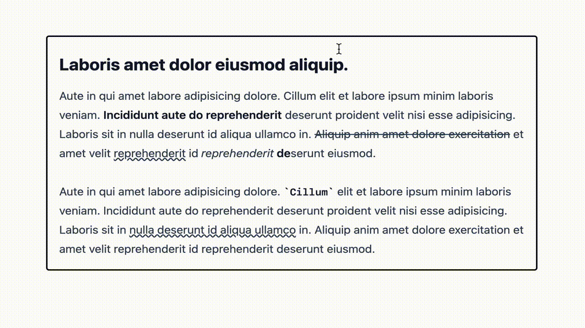

# Lexical React Floating Menu Demo

This project was created as a demo for my blog post:

[How To Build A Floating Menu With Lexical and React](https://konstantin.digital/blog/how-to-build-a-floating-menu-with-lexical-react)



## Installation

```sh
git clone https://github.com/konstantinmuenster/lexical-react-floating-menu.git
cd lexical-react-floating-menu
pnpm install # or npm install
pnpm run dev # or npm run dev
```

## Shortcut needed?

Since interactive editor components are hard to get right, I released `lexical-floating-menu` – a headless and fully customizable plugin to create floating menus easily.

You can simply install and use it as any other npm package.

🌬️ [konstantinmuenster/lexical-floating-menu](https://github.com/konstantinmuenster/lexical-floating-menu)

## About

<a href="https://www.buymeacoffee.com/kmuenster" target="_blank"></a>

Konstantin Münster – [konstantin.digital](https://konstantin.digital)

Distributed under the [MIT](http://showalicense.com/?fullname=Konstantin+M%C3%BCnster&year=2019#license-mit) license.
See `LICENSE` for more information.

[https://github.com/konstantinmuenster](https://github.com/konstantinmuenster)
